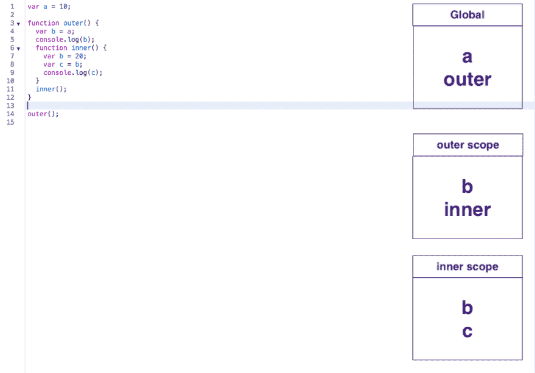
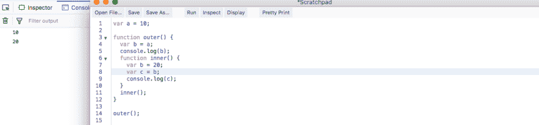
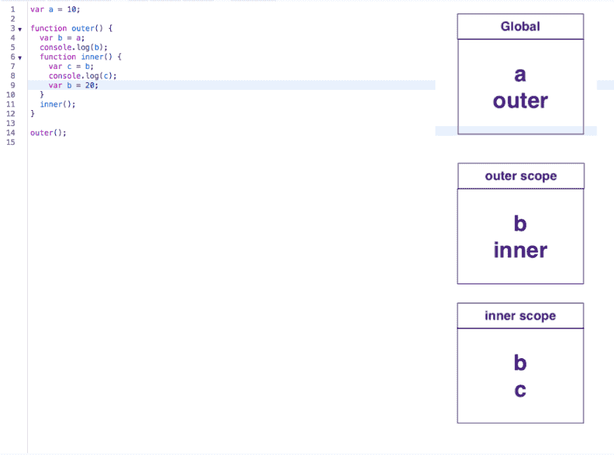
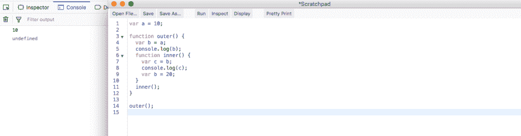
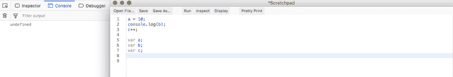
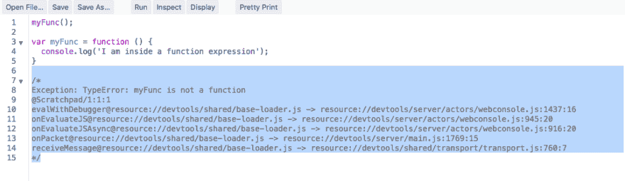

# YDKJS —范围和闭合—第 4 部分

> 原文：<https://dev.to/nabendu82/ydkjs-scopes-and-closures-part4-4kh5>

欢迎来到 YDKJS 系列的第四部分。正如在第 1 部分中所讲的，这个系列是基于我从传奇系列书籍 Kyle Simpson 的《你不知道的 JS》和 Javabrains 的 Kaushik Kothagul 的《Javascript》系列中学到的。

我们将先看一些编译器解释器运行的例子。让我们看第一个例子。

 *第一个例子*

现在编译器的步骤应该很明显了。它找到变量声明和函数声明，并将它们放入它们出现的范围。现在，当解释器运行时，它会转到第 1 行，在全局范围内从编译器中找到一个，并将值 10 赋给它。然后，它在第 14 行找到下一次执行，并从编译器的全局范围中找到外部函数。现在它进入函数 outer 内部并检查 b，在外部作用域中找到 b，并将其赋给 a 的值，该值是从编译器的全局作用域中获得的。下一行 5 打印了 ***b ie 10*** 的值。

接下来，解释器执行第 11 行，并在编译器的外部作用域中找到它。然后，它进入内部，在第 7 行询问编译器它有一个名为 b 的变量，是的，它有这个变量，所以将值 20 赋给 b。然后，它在内部作用域中找到 c，并在第 9 行将 ***c 的值打印为 20*** 。
所以，当我们执行它时，下面的内容就打印出来了。

 * 10、20 印*

现在，你可能会想，10 和 20 得到打印是很明显的，所以为什么要通过编译器和解释器的步骤。让我们稍微改变一下上面的例子，然后我们会在控制台上看到 hat get 的打印。

 *变线 7*

现在，当我们执行编译器步骤时，它类似于前面的例子，即使是内部作用域中的 b。内部作用域中有一个 b，因为编译器发现它是一个 var。

现在当解释器到达第 7 行时，它询问编译器在内部作用域中是否有一个变量 c，然后它得到了它。接下来，它询问编译器在内部作用域的什么地方有一个变量 b，编译器说有。接下来，解释器转到第 8 行并控制 c 的值，这将是**未定义的**，因为它还没有得到 b 的值。

 *必要的编译器和解释器步骤*

所以，这就是为什么有时有必要经历一次编译器和解释器的步骤。

以上也可以用一个简单的例子来说明。我们可能认为下面的代码会在第 1 行给出一个引用错误，因为我们正在对一个未声明的变量进行读操作。但是它给出了 undefined，因为编译步骤发生在它之前，解释器在执行时会给出 undefined。

 * a 未定义*

这个概念在 Javascript 中只被称为提升。

托管意味着当编译器运行并找到所有的 var 声明时，它会将它们移动到文件的顶部。

让我们考虑这个简单的例子。这里我们对 a、b 和 c 进行操作，而没有先声明它们。它们在第 5、6、7 行声明，但是解释器没有抛出运行时错误。因为变量在哪里声明并不重要。当编译器第一次通过时，它们总是被提升到顶部。

 *吊装实例*

函数声明也是如此，从我们之前的知识中我们知道编译器也将函数声明视为变量声明，因为在 JS 中所有的函数声明都是对象声明。

 *函数声明*

但是函数表达式就不一样了。让我们看看下面的例子。

 *给出运行时错误*

这里，当编译器运行时，它在第 3 行注册了一个变量 myFunc，但是它不知道它是什么。所以，当解释器在第 1 行运行时，它抛出一个运行时错误，因为它不知道什么是 myFunc。

所以，函数表达式只有在定义后调用时才能运行，这样我们就完成了编译器和解释器的步骤。

 *函数表达式运行方式*

一些 javascript 疯狂的行为，比如我们可以给未声明的变量赋值，并不是很多开发者所希望的。我们可以使用 Ecma Script 5 中引入的严格模式对其进行限制。

考虑下面的例子，其中我们声明了一个变量 **myName** 。在我们程序的某个地方，我们把它拼错成了**我的名字**并赋值。所以，JS 做的是创建一个新变量**我的名字**，并给它赋值。显然，这不是我们想要的。

 *不可取的特征*

因此，我们通过在程序顶部写“使用严格”来使用严格模式。现在如果我们运行这个程序，它会给出一个运行时错误。

 *使用严格模式*