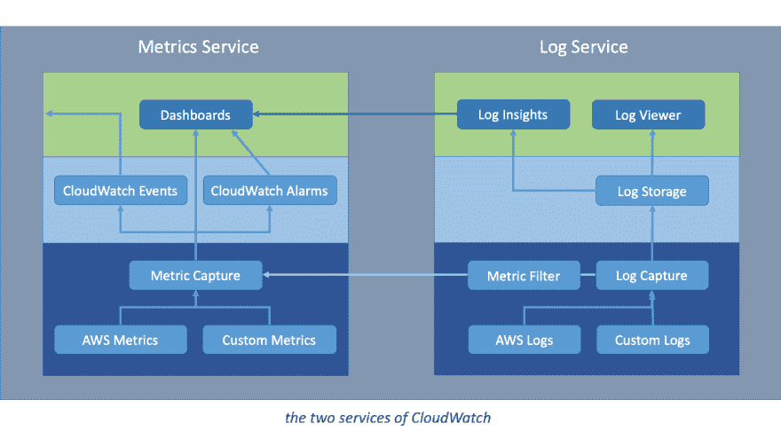
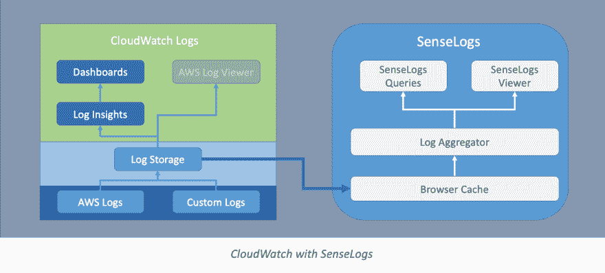
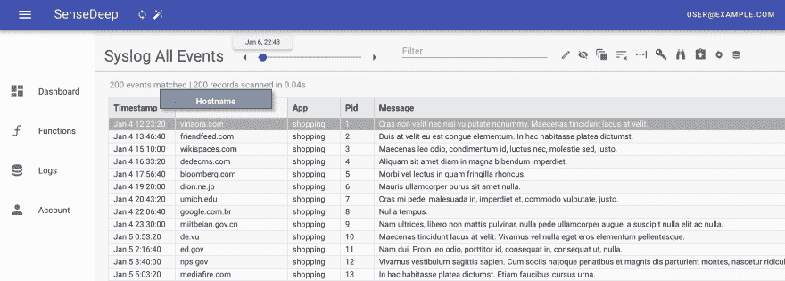

# 你不需要 SumoSplunkDog

> 原文：<https://dev.to/sensedeep/you-don-t-need-a-sumosplunkdog-54j3>

企业日志解决方案有这么多: **Sumo Logic、Splunk、DataDog** 等等。庞大、复杂、强大、昂贵的日志记录解决方案。但是你真的需要它们吗？

如果你是一家世界 500 强公司，也许是的。但是如果你是一个创业公司或者更小的团队，你可能会有更好的选择。

对于运行在 AWS 上的中小型网站和服务，有更简单、成本更低的替代方案。

## 大站点的日志是什么样子的？

对于大型企业，日志记录有几个关键属性:

*   能够将来自无数来源的数据捕获到一个集中的存储库中
*   能够接收大量数据并将其索引到大型强大的数据库中
*   支持多种多样的日志和度量数据消费者

典型的企业场景是从数据库、集群、服务器、容器、lambdas、网络流日志、网络硬件、网关、防火墙等捕获日志。然后，通过多种方式，这些日志被路由到一个企业日志服务，如 **SumoSplunkDog** 或一个带有 LogStash 和 Kibana 的大型 ElasticSearch 集群，以进行查询。最后，一组监控人员将监视这个基础设施，并帮助内部客户访问数据。将有一套工具来帮助记录、度量和跟踪。最终结果是:一个非常昂贵和复杂的解决方案。

企业日志有它的优点，但是有什么缺点呢，特别是对于较小的公司？

## 企业日志问题

### 多份

在从云资源到企业日志服务的过程中，日志数据会被复制多次。如果来自 AWS，它将首先被 AWS CloudWatch 捕获和存储，然后被复制、缓冲并通过 Lambdas 传递给企业日志服务。这些多次复制和传输都会产生额外的云费用。您需要支付多次费用来传输和存储数据。显然，对于大量数据，这可能会非常昂贵。

### 延迟，请等待您的日志...

多份拷贝也意味着延迟。缓冲意味着在向下游发送数据之前等待更多的数据积累。简而言之，在企业日志解决方案中，日志数据通常会延迟几分钟才可用。营销口号是:

> “Live Tail 功能使您能够近乎实时地查看所有日志事件”

但是几分钟的延迟并不等同于“接近实时”。这个故事是一派胡言。现实情况是，您需要等待几分钟，甚至五分钟以上才能访问您的日志。

## AWS 标配什么？

在你花大价钱购买一个企业日志解决方案之前，仔细看看 AWS 能提供什么。较小的站点仍然需要集中式日志记录、指标、警报和状态仪表板。但规模要小得多。AWS 有这样一个产品:CloudWatch。

如果你正在使用 AWS 作为你的云提供商，不管你是否知道，你已经在使用 CloudWatch 了。AWS CloudWatch 是 AWS 服务的统一监控服务，但你也可以将其用于你所有的云服务和应用。AWS CloudWatch 从 EC2 实例、RDS 数据库、VPC、Lambda 函数和许多其他服务等资源中收集和存储操作指标和日志文件。使用 CloudWatch，您可以监控您的 AWS 帐户和资源，并生成一系列事件或针对特定条件触发警报和操作。要了解更多关于 CloudWatch 的信息，请阅读:[什么是亚马逊云手表](//./what-is-cloudwatch.html)。

> AWS CloudWatch 是针对 AWS 服务和您的应用程序的统一监控服务。

## 云手表的长处

CloudWatch 由两个关键服务组成:

*   一种日志服务，用于捕获、存储和管理服务和应用程序日志。
*   一种统一的指标服务，用于捕获和管理资源性能和运营指标。

度量服务和日志服务都是可靠但基本的产品。

日志服务捕获、接收和存储 AWS 和自定义日志。它管理保留，并提供多个选项将日志导出到其他服务。
指标服务为 AWS 服务提供基本的运营指标。这些指标可以触发警报、发出通知、调用自动化操作，并通过仪表板以图形方式呈现。

CloudWatch 的主要优势是:

*   区域内日志的单点捕获、存储和管理
*   一整套指标、查询、警报、事件和仪表板

好吧，但是 CloudWatch 缺什么？

## cloud watch 的弱点

*   日志未聚合
*   查看器是基本的，速度很慢
*   获取日志数据是手动的，并且不透明
*   所有组件都是基本产品

### 日志数据不汇总

CloudWatch 将日志存储在区域、日志组和日志流的三级层次结构中。不幸的是，这些并没有聚合成一个统一的视图。因此，找到正确的日志流可能很困难，尤其是在使用 AWS Lambda 创建大量流的时候。

日志在范围上是区域性的，即它们是通过捕获它们的 AWS 区域来存储和访问的。没有跨所有区域的日志全局视图。

### 基本查看器

AWS CloudWatch 日志查看器相当简单，可以一页一页地显示单个日志流的日志数据。查看器很慢，这加剧了日志聚合的不足。加载日志事件的新页面通常需要 2-4 秒。当拥有的日志流未知时，定位特定的日志事件是一项缓慢而费力的工作。

CloudWatch Insights 产品提供了复合查询功能。但是对于具有适量日志数据的单个查询，查询可能需要一分钟以上的时间。

## 用 SenseDeep 改造 CloudWatch

在 SenseDeep 开发无服务器云应用时，我们对访问 CloudWatch 日志感到沮丧。我们需要一个快速的日志查看器，支持平滑的无限滚动和结构化的日志数据显示，我们还需要更强大的查询。因此，我们创建了 SenseDeep，一个运行速度惊人的 CloudWatch 日志查看器，100%在您的浏览器中运行。它透明地下载日志事件并将其存储在您的浏览器应用程序缓存中，以便立即查看，没有延迟。它提供了平滑的滚动、实时的尾部和强大的结构化查询。

SenseDeep 建立在 CloudWatch 的日志捕获和存储的坚实基础之上，并转变您快速获得关于您的应用的洞察力的能力。

AWS CloudWatch 和 SenseDeep 共同为中小型网站提供了全面的日志记录解决方案，是诉诸传统企业日志记录解决方案的有效、简单的替代方案。

## 试试 SenseDeep

欢迎您在:[https://app.sensedeep.com/](https://app.sensedeep.com/)免费试用，或在:[https://www.sensedeep.com/doc/](https://www.sensedeep.com/doc/)了解更多关于 SenseDeep 的信息。

## 参考文献

*   [SenseDeep — CloudWatch 转型](https://www.sensedeep.com)
*   [云日志清单](//./cloud-logging-checklist.html)
*   [什么是 AWS 云手表](//./what-is-cloudwatch.html)
*   [CloudWatch 仪表盘](//./cloudwatch-dashboards.html)