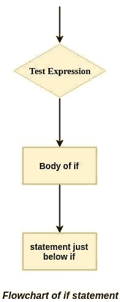
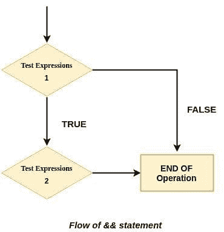
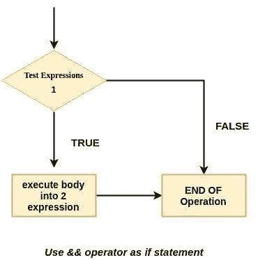
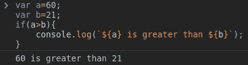
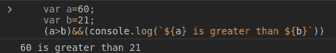
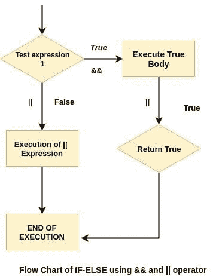
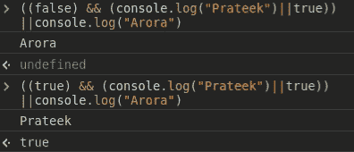

# 您可能不需要 if-else 语句😎

> 原文：<https://dev.to/prateekarora/you-may-not-need-the-if-else-statement-44l6>

这篇文章最初写在我的博客 [PrateekCodes](https://prateekcodes.com/you-may-not-need-the-if-else-statement) 上。

所以，今天我将向你展示一个小的`simple tip`写一个 *if 语句*而不用 *if 语句*的简短方法。是`IF statement`的一个简短、简单、最酷的版本。

> 这可以帮助你稍微清理一下你的代码，让它更容易阅读。

### 让我们看看 *if 语句*是如何工作的:

An `if statement`评估括号`()`内的测试表达式

*   如果测试表达式是`true`，则执行`if`主体内的语句。
*   如果测试表达式为`false`，则不执行`if`主体内的语句。

[](https://res.cloudinary.com/practicaldev/image/fetch/s--QI5q1vYr--/c_limit%2Cf_auto%2Cfl_progressive%2Cq_auto%2Cw_880/https://miro.medium.com/max/196/0%2AJVesuaO-AYXt-yIs.jpg)

我们来看看代码我们是怎么一边写代码一边写`if statement`的？？

让我们看看 *if 语句*的代码是什么样子的:

```
 if(condition){
        //block of code to be executed if the condition is true
    } 
```

### 现在我们来看一下`&&`运算符

`&&`操作员也被称为`logical AND operator`。它从左到右计算操作数，并返回第一个 falsy 值。
T3T5】

*   对于每个操作数或事例，`&&`运算符将值转换为布尔值。如果输出为`false`，则停止执行，返回最后一个操作数值。
*   如果所有操作数或事例都是`true`，则返回最后一个操作数。

```
//If the first operand is true,
//return the second operand

alert( 1 && 3 ); // 3

//if the first operand is falsy,
//return first false value,
//and ignore left operands

alert( null && 2 ); // null 
```

### 现在让我们来看看写 if 语句的最短方法

基本上，要使用`&&`操作符创建您自己的 if 语句，您必须遵循以下结构

[](https://res.cloudinary.com/practicaldev/image/fetch/s--I_Qmhsra--/c_limit%2Cf_auto%2Cfl_progressive%2Cq_auto%2Cw_880/https://miro.medium.com/max/370/0%2AWe3oU4GmAdv_wq2i.jpg)

*   (条件)&&(一些说明)
*   例如:someVar > someOtherVar & & console . log(' yeah ')如果 some var 大于 some other var，将记录' yeah '。####使用 *If 语句*

```
var a=60;
var b=21;
if(a>b){
    console.log(`${a} is greater than ${b}`);
} 
```

**输出**
[](https://res.cloudinary.com/practicaldev/image/fetch/s--gEVSLckV--/c_limit%2Cf_auto%2Cfl_progressive%2Cq_auto%2Cw_880/https://miro.medium.com/max/404/0%2AV2qPjlADSEcjwH9i.png)

#### 使用 *& &运算符*

```
var a=60;
var b=21;
(a>b)&&(console.log(`${a} is greater than ${b}`)) 
```

**输出**
[](https://res.cloudinary.com/practicaldev/image/fetch/s--IknXODSN--/c_limit%2Cf_auto%2Cfl_progressive%2Cq_auto%2Cw_880/https://miro.medium.com/max/483/0%2AJXOTaOVhAZtNW4o-.png)

在这个例子中，我们创建了两个 if 语句。一个使用传统方法，另一个使用&&运算符，检查`(a>b)`是否正确。正如我们所看到的，两种情况都记录在同一个控制台上。

> 您也可以使用`&&`和`||`运算符创建自己的 if-else

[](https://res.cloudinary.com/practicaldev/image/fetch/s--mKsVevm5--/c_limit%2Cf_auto%2Cfl_progressive%2Cq_auto%2Cw_880/https://miro.medium.com/max/361/0%2AwjesaefcMakUp4bK.jpg)

*   首先，写一个类似`(true or false)`的 if 条件
*   如果条件为真，操作符执行真值体，当发现真值时|| (or 操作符)停止执行。 **||返回第一个真值 false** 。

*   使用||运算符时，如果条件为 falsy，则执行 Else。||运算符移到下一个操作数，以找到第一个真值。

#### 举例

[](https://res.cloudinary.com/practicaldev/image/fetch/s--UTedo_fp--/c_limit%2Cf_auto%2Cfl_progressive%2Cq_auto%2Cw_880/https://miro.medium.com/max/396/0%2A93FbGjJZAkvpErEs.png)

#### 由 own 执行并创建自己的 if-else 语句😂

```
((false) && (console.log("execute when condition true")||true))
||console.log("execute when condition false") 
```

* * *

非常感谢您阅读我关于**的文章，您可能不需要 if-else 语句！**请务必关注我在[推特](https://twitter.com/prateek_codes)上发布的大量关于科技的推文。欢迎在下面发表评论或发微博给我，告诉我你的任何问题。