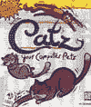
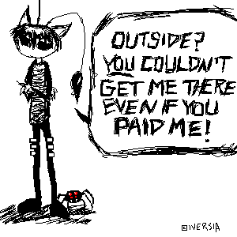
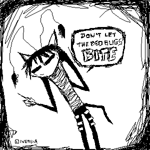
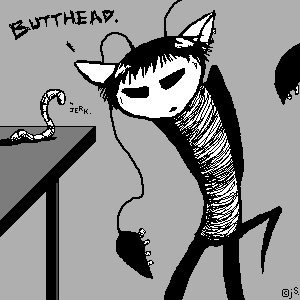
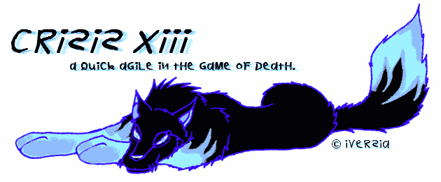
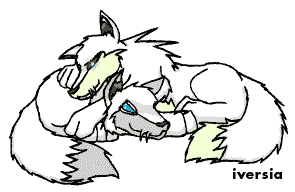
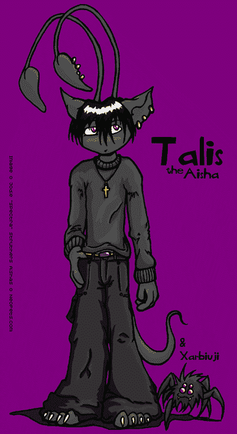
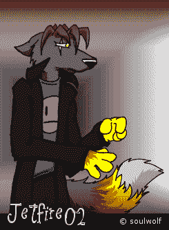
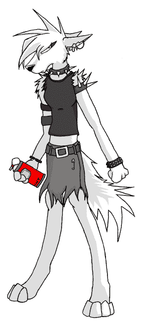
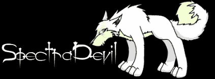

# 你偷了我在尼奥宠物上的源代码

> 原文：<https://dev.to/jodie/you-stole-my-source-code-on-neopets-513g>

我喜欢阅读关于有多少人第一次在 Neopets 上接触设计和编程的文章。Neopets 过去是(现在仍然是)一个虚拟的聚宝盆，里面有*社区*和*学习*。

我和尼奥宠物有很长的历史。当 Neopets 首次推出时，我的许多朋友都被吸引了进来，因为他们是 1995-1999 年 Dogz 和 Catz (Petz)社区的一部分。我们的一些 Petz 粉丝网站被特别锁定，并被要求查看 Neopets。这是一场完美的比赛。

当时，Petz 社区的许多人都热衷于逆向工程(不管他们是否这样称呼它)。我们将获取 Petz 文件，使用资源编辑器(比如 [ResHack](https://en.wikipedia.org/wiki/Resource_Hacker) )，并根据我们的喜好修改它们。我的主要目标是修改源 Catz 和 Dogz 文件，使它们看起来像我的“真实生活”宠物。其他人创造了全新的“Breedz”这是一个令人惊讶的充满活力的社区。

<figure> 

<figcaption>桌面/屏保 Catz 游戏，有什么不爱？由 P.F. Magic 制作。</figcaption>

</figure>

当我们被邀请去参观尼奥宠物时，我们把它当成了我们的第二故乡。我们不仅仅是一个只与虚拟桌面用户玩游戏的简单团队。我们很好奇，我们很有创造力，而且在大多数情况下，我们都很乐于助人。

Neopets 不是一个非常安全的网站(明文密码、广泛的 XSS、糟糕的过滤器、会话/cookie 劫持)。除了让人们进入设计和编程，它还让人们对黑客(所有的帽子)、自动化、渗透测试和社会工程感兴趣。Neopets 吸引了许多高技术和有才华的人。

当我开始玩 Neopets 的时候，我是已经知道 HTML/CSS 的人之一。我会定制和美化我的个人资料和宠物页面。我的页面变成了一个活跃的温床，人们来查看我的作品和源代码。人们把我作为灵感和教育的源泉。我曾经在代码的注释中给人们写注释。比如:“你可以拿走这部分，但是从这里开始，至少要修改十六进制代码！那就是 xool，cyas！”

塔利斯，我的阿伊莎，变得很受欢迎。他很急躁。他很酷。他收到了很多粉丝的作品。如今，大多数作品在尼奥宠物上是不可接受的。他们艰难地从愉快的大学氛围转向家庭友好的领域。

<figure>

<figcaption>It's almost as if I really liked JTHM by Jhonen Vasquez. Talis the Aisha, drawn with a mouse on various oekaki boards.</figcaption>

</figure>

我有很多人浏览我的尼奥宠物页面。Neopets 提供了基本的统计数据(每日页面浏览量)。我们也有新圈。新圆环是他们版本的网环。Web rings 能够将定制的宠物页面链接在一起，甚至更容易找到类似的内容。如今，搜索引擎已经填补了这一空白，但我有时会错过策划网络环。

我使用图像和 Neopets 上的糟糕过滤来编写自己的分析脚本。我的脚本可以抓取用户信息(如用户名)，并将其馈送到我自己的网站。我可以知道到底是谁在浏览我的网站，以及浏览的频率。非常基本的谷歌分析。我给自己建了快速链接，这样我就可以给有趣的人发信息，查看他们的个人资料。我分析了 HTTP 请求，并了解到我可以将自定义文本注入到爱好/兴趣字段中。这些爱好没有经过服务器端验证，也没有 CSRF 保护，所以我可以注入任何我想注入的东西。

当时，这很有趣。我可以让我的个人资料写各种各样的傻事(倒树懒博士的垃圾，做果冻的白日梦，吃甜甜圈，等等)。它还强调了该网站的可开发性。宠物页面、个人资料甚至商店都存在安全漏洞。随着时间的推移，这些问题最终得到了解决，但在最初的几年里，它是疯狂的。

我收集人。在我有一个行会之前，我有一群可靠的(新)朋友。当尼奥宠物添加了公会功能后，我的朋友敦促我创建一个。在我们让 Neopets 团队为我们创建“角色扮演”neoboard 之前，我们一直在 neo board 中闲逛，主要是在“邪恶的东西和怪物目击”(RIP)中。(不客气，哈利波特，口袋妖怪，火影忍者粉丝。)

我创建了自己的公会。

**抓住黑夜** (StN)本来是无名的。我一直在创建标签为“[x] Lupe Role Play [x]”的角色扮演板，但当公会创建时，我们需要有一个集体名称。像一群。我选择了《抓住夜晚》,它是根据迪安·孔茨 1998 年的同名小说改编的。(我需要一个把手，伙计。)

<figure> 

<figcaption>原【x】夺夜【x】标志。</figcaption>

</figure>

它长大了。很快。在最初的几个月里，它发展到 260 名成员。我实施了一个理事会，然后一个分理事会，以帮助人们的涌入。然后 320 人。440.520.大约在这个时候，行会变得笨拙。

如果你在我们的公会留言板上留言，你的留言会在页面重新载入时消失。你会淹没在声音中。

没有合适的穿线。没有适当的节制。没有办法实现任何形式的升级路径。甚至没有任何可见的迹象表明谁是谁不是公会管理员。你必须深入挖掘成员列表或访问个人资料来找出答案。

尼奥宠物给我们的唯一一种自我调节能力(直到今天)是“删除这条信息”

与此同时，我也在运行一个相当流行的“尼奥皮特代码”(类似于 1993 年的[极客代码](https://en.wikipedia.org/wiki/Geek_Code))。它是由尼奥宠物托管的，我会通过这种方式联系我的公会成员。我的自托管网站有更多的选择，我可以确保人们的声音被听到。

<figure>

<figcaption>Armed with a mouse and Paint Shop Pro 6, I was unstoppable. I started the trend of different flame-coloured Fire Lupes. I am not sorry.</figcaption>

</figure>

然后可预见的事情发生了。作为 Neopets 堵塞安全漏洞和遏制社会工程努力的一部分，他们做了两件事:将停止共享任何个人信息(电子邮件、即时消息句柄、社交网站)作为规则的一部分，并且还使你只能链接到*官方* Neopets 粉丝网站。

我不再能够积极地推广我们装备更好的公会网站，或者给新成员我的联系方式。一切都必须是地下的，口耳相传的，或者通过官方粉丝网站巧妙地提出来。

是的，尼奥宠物地下组织。

<figure>

<figcaption>Talis; Jetfire02 (dressed as Dib; I had not seen Invader Zim yet); SpectraDevil. Punks, all of them.</figcaption>

</figure>

我曾经这样经营过一段时间的公会。太可怕了。人们因违反新规则而被冻结账户。我们有自己的编码语言，但这对那些即将加入的新来者来说毫无意义。我们不能直接解释我们在哪里组织，我们的官方公会委员会是一堆燃烧的垃圾。除非你已经认识某个人，否则你运气不好。它滋生了小集团。许多新人因被忽视而沮丧地离开了。

尽管如此，行会一直在发展壮大。

最终，我决定将一切付之一炬。我招募了一些人，我们删除了公会。有点难过，但是这个公会的删除引起了涟漪效应。我切下了九头蛇的头，我喜欢认为长出来的多个(更小的)头让世界变得更好了一点。

就在那时，我把注意力转向了建立和维护我自己的社区。是什么让《抓住夜晚》最终失败了？我实际上需要什么样的调节选项？我应该有什么样的入职流程？我如何提高别人的声音？什么样的执法？我如何积极应对潜在的骚扰？

我创造了 [Shadowlack](https://shadowlack.com/) (当时被称为 Ramath-lehi)。Shadowlack 继续帮助人们在各种行业找到职业和工作，并建立友谊。我看到过 ESL 学生用它在友好的环境中练习英语。我看着并帮助“我的孩子”成长。

没有尼奥彼得，就没有《夜以继日》。如果没有“抓住夜晚”,我就不会弄清楚是什么组成了一个好的人类生活系统。在更长的一段时间里，我会学到更多的惨痛教训。抓住夜晚窒息因为尼奥宠物决定创造和执行规则(好！)，却没有给我们组织和茁壮成长所需的适当工具(糟糕)。

我看到我从 Neopets 中学到的这些经验在脸书和 Twitter 等地方被重复。你的社区的好坏取决于你接纳的人、你选择坚持(或无视)的规则以及你提供的工具。如果你的底线是“这在我的国家不违法”，那么你已经失败了。

我很感激那些偷了我的源代码，抬高了我的浏览量，让我对身边的数字世界更加好奇的人。💙

<figure> 

<figcaption>阴森森的。</figcaption>

</figure>