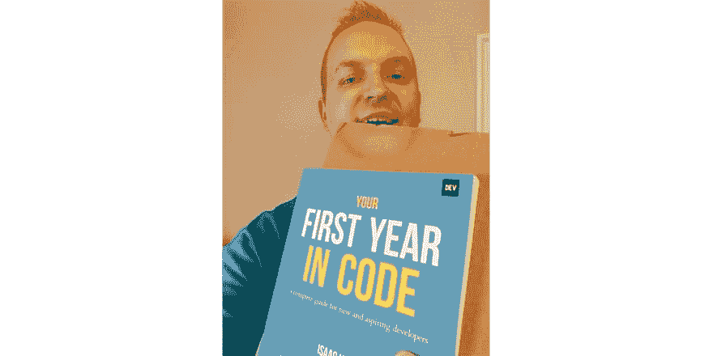

# 你的代码第一年:现已出版！

> 原文：<https://dev.to/devteam/your-first-year-in-code-now-available-in-print-3pai>

两个月前，我们与长期开发者成员， [@isaacdlyman](https://dev.to/isaacdlyman) 和 15 位合著者一起出版了《你的代码元年》。这本书既有技术性的也有非技术性的，为早期职业开发者提供了实用的指导和建议。你们中有更多经验的人将会对许多讲述的故事产生共鸣，并将获得关于新开发人员的观点和挑战的更新。

我们最初将《你的代码元年》作为电子书推出，但我们立即收到了大量索取纸质书的请求，因为不是每个人都喜欢通过屏幕阅读器阅读。*我很高兴地告诉大家，《你的代码元年》已经出版*。艾萨克努力让这本书变得通俗易懂。数字版是一种付费模式，而实体版的标价是 20 美元。我们很高兴这种格式能够改善那些喜欢触觉的人的阅读体验。

购买《你的第一年代码》的最好方式是去你附近的独立书店。在 [IndieBound](https://www.indiebound.org/book/9780578564999) 有一个简单的搜索引擎可以帮你找到。如果去独立不是一个选择，你也可以从以下零售商那里购买(请留下一个积极的评价！):

*   [巴恩斯&贵族](https://www.barnesandnoble.com/w/your-first-year-in-code-isaac-lyman/1133364216)
*   [目标](https://www.target.com/p/your-first-year-in-code-paperback/-/A-78278748)
*   [亚马逊](https://smile.amazon.com/dp/0578564998)

与电子书类似，收益将在获奖的合作作者中分配，所有收益的 10%将直接给编码的女孩。我们刚刚为开发团队的每个人都买了一本，你也应该这样做！

编码快乐！