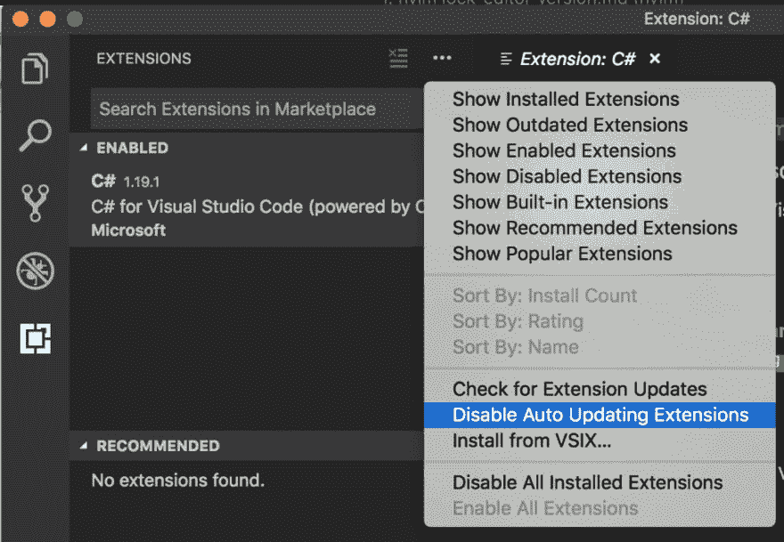

# 你的文本编辑器插件属于一个锁文件

> 原文：<https://dev.to/simple_thread/your-text-editor-plugins-belong-in-a-lock-file-52id>

我刚刚更新了你所有的文本编辑器插件。你的反应是什么？类似这样的？

你已经很多年没有更新那些插件了，是吗？谁会关心那些新特性、错误修复或者性能和安全改进呢？只是祈祷你的笔记本电脑不会死，迫使你升级。更好的是，您有完整的映像备份，对吗？这样你就可以永远保留那些老插件了。

想到要更新那些插件就退缩是可以理解的。大多数开发人员都因为这样或那样的原因被烧伤了。另外，谁有时间听那些废话？在你更新之后，你会遇到插件之间的一些模糊的冲突，或者作者推出了一个测试版。更糟糕的是，新版本的插件是一个真正的性能瓶颈。

当然，问题似乎从来不会在更新后立即出现，而是在最不合适的时候出现。几天后，你的最后期限就要到了。您没有简单的方法来恢复您的更新。见鬼，你甚至不知道哪个插件是罪魁祸首。现在你必须做出选择。你是否苦于调试你的编辑器或禁用插件，一只手绑在背后继续你的工作？

不过更新你的插件并不需要这么痛苦。如果你的编辑器插件像你的应用程序依赖一样有一个锁文件，那不是很好吗？(您锁定了您的应用程序依赖项，不是吗？)然后您可以将该文件添加到版本控制中。回到原来的设置就像打个响指。只需检查之前的提交并运行安装命令。事后看来很明显，对吧？

我已经将我的插件保存在 plugin.lock 文件中大约一年了，这真是太棒了。它的工作方式与您预期的完全一样。我每隔几个月就会更新我的插件。如果我遇到一个问题，不想马上处理，我可以很快回复。为了调试，我可以做一个快速的 git diff 来查看最近更新了哪些插件。如果一个插件运行不正常，我会从我的 git 历史中删除旧版本，继续我的工作。如果我非常想确定哪个插件行为不当，我甚至可以做一个二分搜索法(递归地恢复一半的版本，检查问题是否仍然存在)。

创建和使用你自己的 plugin.lock 文件非常简单。下面我有几个热门编辑的例子。

### **VIM**

使用流行的 VIM 插件管理器 [vim-plug](https://github.com/junegunn/vim-plug)

创建您的锁文件…

`:PlugSnapshot plugin.lock`

从您的锁定文件中恢复…

`:source plugin.lock`

### **Atom**

创建您的锁文件…

`apm list --installed --bare | xargs -L 1 echo apm install > plugin.lock`

从您的锁定文件中恢复…

`sh plugin.lock`

### **VS 代码**

Visual Studio 代码的[内部人员](https://code.visualstudio.com/insiders/)版本支持这一点。

禁用自动扩展更新(如果您还没有这样做)

创建您的锁文件…

`code-insiders --list-extensions --show-versions | xargs -L 1 echo code-insiders --install-extension > plugin.lock`

从您的锁定文件中恢复…

`sh plugin.lock`

———————-

如果你有在其他编辑器中创建 plugin.lock 的说明，请在评论中告诉我！

帖子[你的文本编辑器插件属于一个锁文件](https://www.simplethread.com/editor-plugins-belong-in-lock-file/)首先出现在[的简单线程](https://www.simplethread.com)上。