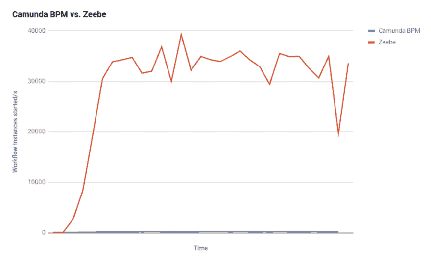
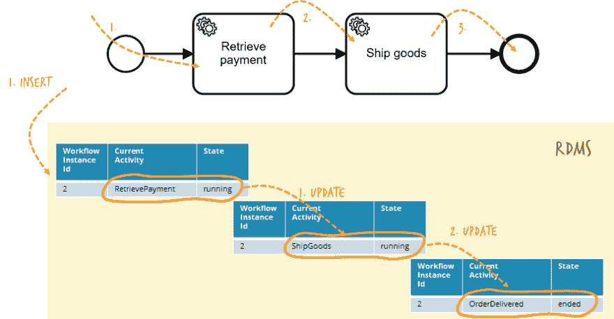
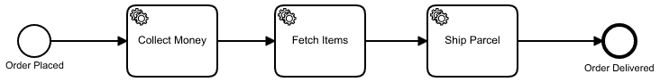
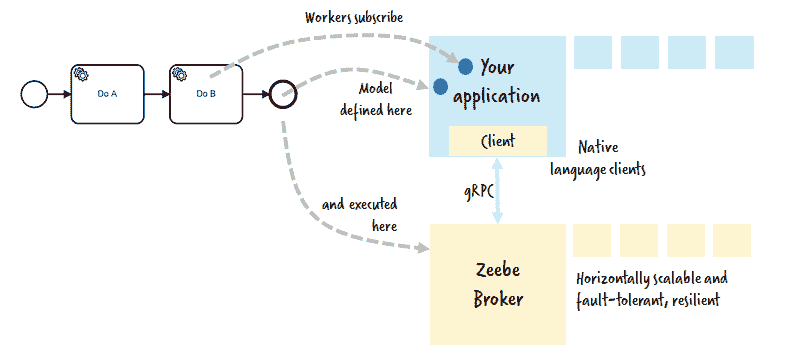
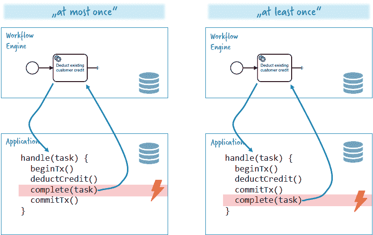
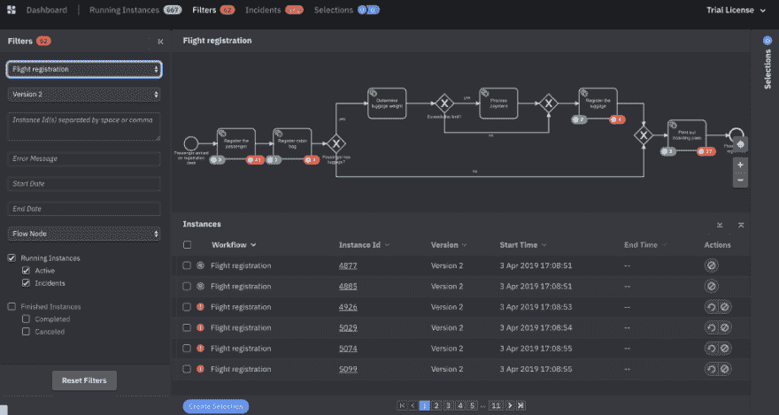
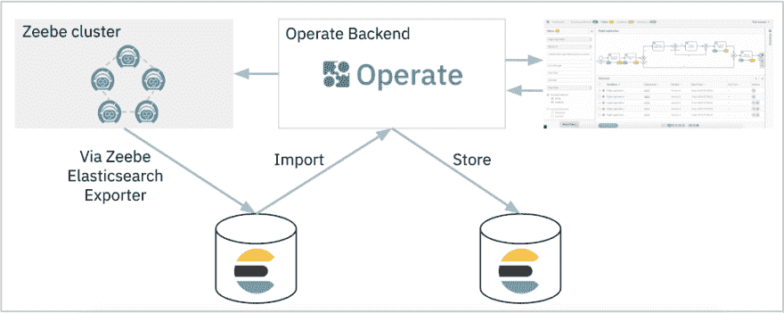

# zee be . io——一个可水平扩展的分布式工作流引擎

> 原文：<https://dev.to/berndruecker/zeebe-io-a-horizontally-scalable-distributed-workflow-engine-23g3>

### zee be . io——一个可横向扩展的分布式工作流引擎

#### 向云原生工作流自动化问好—第 1 部分

工作流自动化有许多用例。许多人认为工作流自动化只用于缓慢和低频率的用例，如人工任务管理。尽管事实并非如此(例如，参见 [24 小时健身](https://blog.camunda.com/post/2017/11/community-day-san-francisco/)或[扎兰多](https://twitter.com/berndruecker/status/910203686793699328))，我确实看到了当前工作流技术在可扩展性方面的局限性，但在一个非常不同的数量级上。由于传统的引擎是基于关系数据库的，它们在规模上自然受限于数据库所能处理的。即使这对于大多数公司来说已经足够了，但我知道肯定有一些有趣的用例需要更高的性能和可伸缩性，例如在非常高的负载下处理需要软实时保证的金融交易。

在过去的几年里，许多在 Camunda 的聪明人深入研究了如何扩展一个工作流引擎，超越更小的迭代改进的问题。这种思考的结果让我们想到了源代码可用的项目 [Zeebe.io](https://zeebe.io/) 。我们[刚刚发布了它的第一个生产就绪版本](https://zeebe.io/blog/2019/07/announcing-zeebe-0-20-production-ready/)！

Zeebe 将推动工作流自动化的前沿，因为它提供了真正的水平可伸缩性。这意味着向系统添加节点将导致能够处理更多的负载，并且这种增加是线性的。

实现这一目标的关键因素是:

*   Zeebe 是一个真正的分布式系统，没有任何中央组件，利用像 [Raft Consensus Algorithm](https://raft.github.io/) 这样的概念来实现可伸缩性和弹性。
*   Zeebe 使用事件源和事件流概念以及复制的仅附加日志。分区允许向外扩展。
*   根据[反应宣言](https://www.reactivemanifesto.org/)将其设计为反应系统。

因此，Zeebe 与 Apache Kafka(T1)等系统处于同一级别。在早期的尝试中，我们可以像 Kafka 一样每秒处理大约多少个事件，这比 [Camunda](http://camunda.com/) 7.8 快几百倍(这是传统工作流引擎的一个例子，实际上根据[卢加诺大学 2016 年 5 月的一项研究](http://www.bpm-guide.de/2016/06/12/scientific-performance-benchmark-of-open-source-bpmn-engines/))，甚至是最快的开源引擎:

那么，我们如何实现这一目标呢？一个重要的想法是建立一个事件源系统。

### 源于事件的工作流引擎

传统的工作流引擎在数据库表中捕获工作流实例的当前状态。如果状态改变，数据库表被更新。简化后，看起来是这样的:

使用这种方法，工作流引擎可以利用来自[关系数据库(RDMS)](https://en.wikipedia.org/wiki/Relational_database_management_system) 的大量保证，例如 [ACID 事务](https://en.wikipedia.org/wiki/ACID)。

Zeebe 的工作方式非常不同，它利用 [**事件源**](https://martinfowler.com/eaaDev/EventSourcing.html) 。这意味着对工作流状态的所有更改都被捕获为*事件*，这些事件与*命令一起存储在事件日志中。*两者都被认为是日志中的*记录*。*快速提示*[*DDD*](https://en.wikipedia.org/wiki/Domain-driven_design)*爱好者:这些事件是 Zeebe 内部的，与工作流状态有关。如果你在你的领域内运行你自己的事件源系统，你通常为你的* [*领域事件*](https://martinfowler.com/eaaDev/DomainEvent.html) *运行你自己的事件存储。*

记录是不可变的，因此日志是**只追加**。一旦写了，什么都不会改变，它就像一本会计日志。只附加日志可以非常有效地处理和扩展，这一点我们将在本文的第二部分中深入探讨。

工作流的当前状态总是可以从这些事件中导出。这被称为**投影**。Zeebe 中的投影在内部保存为快照，利用 [RocksDB](https://rocksdb.org/) ，一个非常快速的键值存储。RocksDB 允许 Zeebe 在内部通过关键字查找某些对象，因为纯日志甚至不允许像“给我工作流实例 2 的当前状态”这样的简单查询。

Zeebe **将日志存储在磁盘**上。目前，这是唯一受支持的存储选项(其他选项，例如 [Apache Cassandra](http://cassandra.apache.org/) 经常被讨论，但到目前为止还没有出现在路线图上)。RocksDB 还将快照状态刷新到磁盘，这不仅大大加快了启动速度，还允许 Zeebe 从日志中删除已处理的记录，保持日志的紧凑性(这一点我们将在本文的第二部分的[中深入探讨)。](https://dev.to/berndruecker/how-we-built-a-highly-scalable-distributed-state-machine-10hd)

为了实现**性能、弹性和可扩展性**，我们应用了以下分布式计算概念:

*   点对点集群，[八卦](https://en.wikipedia.org/wiki/Gossip_protocol)，
*   [Raft 一致性算法](https://raft.github.io/)，
*   分区，
*   高性能计算概念和高性能协议 gRPC。

我将在本文的第二部分深入讨论这个问题:[我们如何构建一个高度可扩展的分布式状态机](https://dev.to/berndruecker/how-we-built-a-highly-scalable-distributed-state-machine-10hd)。

### Zeebe 架构及用法举例

Zeebe 作为一个自己的程序在 Java 虚拟机(JVM)上运行。与运行工作流引擎的[架构选项相关](https://blog.bernd-ruecker.com/architecture-options-to-run-a-workflow-engine-6c2419902d91)这是**远程引擎**方法，因为使用 Zeebe 的应用程序与它进行远程对话。但是当我们利用**流**进入客户端并使用**二进制通信协议**时，这是非常高效和高性能的。它的巨大优势是代理有一个明确的设置和环境，不会受应用程序代码的影响。因此，这个设计决策提供了适当的隔离，我们在多年支持工作流引擎的经验中了解到这一点的重要性。

#### 可视化工作流程

Zeebe 使用 [ISO 标准 BPMN](https://camunda.com/bpmn/) 中的**可视化工作流定义**，可以用免费的 [Zeebe Modeler](https://github.com/zeebe-io/zeebe-modeler/) 图形化建模。

如果您愿意，您还可以使用 [YAML 来描述工作流，例如](https://docs.zeebe.io/yaml-workflows/README.html):

[https://medium . com/media/5d 536155037 b 6 f 30 f 5809 bb 1439018 db/href](https://medium.com/media/5d536155037b6f30f5809bb1439018db/href)

请注意，YAML 目前并不支持所有的语言结构。

#### 支持反应式编程、流和反压的母语客户端

工作流可以包括所谓的*服务任务*。当一个实例到达这些任务时，需要执行一些代码。这是通过创建由应用程序中的*作业工人*获取的*作业*来完成的。Zeebe 提供本地语言客户端，例如在 [Java](https://docs.zeebe.io/java-client/README.html) 中:

[https://medium . com/media/79 b 16d 0 be 1130 a 17 e 63 a 14 D2 CAC 2830 e/href](https://medium.com/media/79b16d0be1130a17e63a14d2cac2830e/href)

或者在 [NodeJs](https://creditsenseau.github.io/zeebe-client-node-js/) 中:

[https://medium . com/media/ee 3403 f1 e 552007012 ea ade 0528d 7769/href](https://medium.com/media/ee3403f1e552007012eaade0528d7769/href)

或者在 [C#](https://github.com/zeebe-io/zeebe-client-csharp) 中:

[https://medium . com/media/d0f 6d 9d 0 e 0 ef 16537 C2 c8 beb 84 C3 B3 ff/href](https://medium.com/media/d0f6d9d0e0ef16537c2c8beb84c3b3ff/href)

或者在[转到](https://docs.zeebe.io/go-client/README.html):

[https://medium . com/media/9 CD 7 ce 1e 5144881915419 a 776313 f87f/href](https://medium.com/media/9cd7ce1e5144881915419a776313f87f/href)

或者在[锈](https://github.com/zeebe-io/zeebe-client-rust)或[红宝石](https://github.com/zeebe-io/zeebe-client-ruby)中。更多的语言将随之而来。多亏了 [gRPC](https://grpc.io/) ，使用几乎任何编程语言都很容易，正如[在这篇关于如何使用 Python](https://zeebe.io/blog/2018/11/grpc-generating-a-zeebe-python-client/) 的帖子中所描述的。

正如您可能在代码中发现的那样，您可以在应用程序中使用反应式编程模型。

您可以将任意多的客户端连接到 Zeebe，作业将被分配(目前以循环方式)，从而允许工作人员的灵活可伸缩性(向上和向下)。Zeebe 将很快支持[背压](https://www.reactivemanifesto.org/glossary#Back-Pressure)，因此要确保工作以客户能够处理的速度提供。没有客户会被工作压得喘不过气来。如果有疑问，作业会保存在 Zeebe 中，直到新的客户端连接。

客户端是竞争的消费者，这意味着一个任务只能由其中一个客户端执行。这是使用一个锁事件实现的，该锁事件需要在执行作业之前写入 Zeebe。只有一个客户端可以写入锁定事件，其他尝试这样做的客户端会收到错误消息。在自动移除锁之前，锁会被保持一段可配置的时间，因为在这种情况下，Zeebe 假设客户端已经意外死亡。

#### 事务和至少一次语义

值得注意的是，Zebee 客户端没有**而不是**实现任何形式的 [ACID 事务协议](https://en.wikipedia.org/wiki/ACID)。这意味着在失败的情况下，不会回滚任何事务。通过这种设置，您有两种设计选择:

1.  您将事务提交到您的域，然后通知 Zeebe 任务完成。现在，您的应用程序可能会在提交和完成之间崩溃。所以 Zeebe 不知道作业已经完成，并在锁超时后将它交给另一个客户机。该作业将再次执行。语义是“**至少一次**”。
2.  您首先完成作业，然后提交事务。如果应用程序在此期间崩溃，您可能已经完成了作业，但没有提交事务。工作流程将会继续。语义是“**最多一次**”。

大多数时候你会决定“最多一次”，因为这在大多数用例中最有意义。

因为你的代码可能被多次调用，所以你必须使你的应用程序逻辑**幂等**。这在您的领域中可能是自然的，或者您可能会想到其他策略并创建一个[幂等接收器](http://www.enterpriseintegrationpatterns.com/patterns/messaging/IdempotentReceiver.html)(参见例如 [Spring Integration](https://docs.spring.io/spring-integration/reference/html/messaging-endpoints-chapter.html#idempotent-receiver) )。我在 [3 微服务集成的常见陷阱——以及如何避免它们](https://www.infoworld.com/article/3254777/application-development/3-common-pitfalls-of-microservices-integrationand-how-to-avoid-them.html)中简要讨论了幂等性，并计划了一篇关于它的扩展文章。

### 通过 CQRS 查询

Zeebe 代理负责执行正在运行的工作流。为了达到开头提到的性能和可伸缩性目标，对当前状态应用新命令进行了优化。但是代理不能处理任何查询，比如“今天早上 8 点到 9 点之间启动了哪些工作流实例，但是还没有完成？”。因为我们不再使用关系数据库，所以我们不能执行简单的 SELECT 语句。在这种情况下，我们确实需要一种不同的方法来处理所谓的查询模型。

这种分离命令和查询模型的方式被称为[命令查询责任分离(CQRS)](https://martinfowler.com/bliki/CQRS.html) ，具有很大的优势:

> CQRS 允许您将负载从读取和写入中分离出来，从而允许您独立扩展每一项。[……]你可以对两边应用不同的优化策略。这方面的一个例子是使用不同的数据库访问技术进行读取和更新。

这正是我们对齐伯所做的。代理利用事件流，并针对高吞吐量和低延迟进行优化。但是它不提供查询功能。这就是为什么 Zeebe 提供所谓的[导出器](https://docs.zeebe.io/basics/exporters.html)来访问整个事件流。一个[开箱即用的导出器用于弹性搜索](https://github.com/zeebe-io/zeebe/tree/master/exporters/elasticsearch-exporter)。通过使用它，所有事件都被写入到 Elastic 并存储在那里，以备查询。

Zeebe 现在附带了一个操作工具，您可以使用它来查看工作流引擎: [Operate](https://docs.zeebe.io/operate-user-guide/install-and-start.html) 。您[可以看到发生了什么，识别问题(所谓的事件)以及导致和修复事件的根源](https://zeebe.io/blog/2019/04/announcing-operate-visibility-and-problem-solving/)。

<figure> 

<figcaption>操作截图</figcaption>

</figure>

Operate 也是按规模构建的，并在 [Elasticsearch](https://www.elastic.co/de/products/elasticsearch) 上使用自己的优化指数:

### Source-可用许可和开源

一个有趣的旁注是关于开源的。你可能会关注围绕可用资源许可证的最新进展(例如来自[蟑螂实验室](https://www.cockroachlabs.com/blog/oss-relicensing-cockroachdb/)、[合流](https://www.confluent.io/blog/license-changes-confluent-platform)、 [MongoDB](https://dev.to/mongodb/mongodb-now-released-under-the-server-side-public-license-1mh4-temp-slug-3578769) 、 [Redis](https://redislabs.com/blog/redis-labs-modules-license-changes/) 、[时标](https://blog.timescale.com/how-we-are-building-an-open-source-business-a7701516a480/))。其背景是，云供应商可以简单地采用现有的开源项目并提供托管服务，而无需向社区支付任何回报。大型云供应商通常可以利用他们的市场地位，轻松地与开源公司自己的托管服务产品竞争。这可能会耗尽社区，但也会对核心开发人员在工资单上的公司构成生存威胁。从长远来看，这可能会扼杀很多创新。来源可用许可证保护开源公司免受这种威胁，即使[开源倡议(OSI)](https://opensource.org/) 不承认这些许可证是开源的，因此有了这个笨拙的名字。

Zeebe 是在 Zeebe 社区许可下发布的，这是一个可比较的源代码许可。它

*   允许[麻省理工学院许可](https://opensource.org/licenses/MIT)所允许的(基本上是一切)**除了**
*   它不允许你提供使用 Zeebe 的商业工作流服务

该许可证允许现有用户和客户的所有预期使用情形。它实际上“感觉”像麻省理工学院。您可以下载、修改和重新发布 Zeebe 代码。你可以在商业产品和服务中包含 Zeebe。只要你不提供通用的工作流服务。

### 总结

Zeebe 被设计成一个真正可扩展和有弹性的系统，没有中央数据库。它很有表现力。它可以和几乎任何编程语言一起使用。它使用 BPMN 的视觉工作流程，允许真正的 [BizDevOps](https://blog.bernd-ruecker.com/bizdevops-the-true-value-proposition-of-workflow-engines-f342509ba8bb) 。这种组合使它有别于我所知道的任何编排或工作流引擎。

它是开源的(准确地说是可用的),使用非常简单。所以[开始](https://docs.zeebe.io/introduction/install.html)没有障碍。

有兴趣了解更多我们用来构建 Zeebe 的分布式计算概念吗？继续阅读我的深度文章[我们如何构建高度可扩展的分布式状态机](https://dev.to/berndruecker/how-we-built-a-highly-scalable-distributed-state-machine-10hd)。

Bernd Ruecker 是 [Camunda](http://camunda.com/) 的联合创始人兼首席技术专家。我对开发人员友好的工作流自动化技术充满热情。*跟我上* [*推特*](http://twitter.com/berndruecker/) *。*一如既往，我喜欢收到您的反馈。下面评论或者[发邮件给我](http://bernd.ruecker@camunda.com)。

* * *