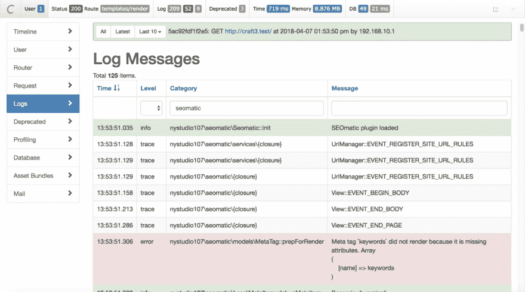

# 禅和工艺 CMS 日志文件读取的艺术

> 原文：<https://dev.to/gaijinity/zen-and-the-art-of-craft-cms-log-file-reading-5b44>

# 禅与兵法 CMS 日志文件阅读

### 就像黑盒记录一样，日志文件包含重要的证据信息，供您在诊断问题时使用。让我们学习阅读它们的艺术

安德鲁·韦尔奇

[](https://res.cloudinary.com/practicaldev/image/fetch/s--Sv66Wcnc--/c_limit%2Cf_auto%2Cfl_progressive%2Cq_auto%2Cw_880/https://nystudio107-ems2qegf7x6qiqq.netdna-ssl.com/img/blog/_1200x675_crop_center-center_82_line/zen-sand-japanese-rock-garden.jpg)

在程序设计中，古老的日志记录方法不仅用来记录发生的错误，而且用来记录一般的状态信息。当你试图弄清楚发生了什么时，这种上下文使它们很有用。

<aside>Or more often than not, ​“What went wrong?”</aside>

日志文件是你的“黑匣子”,记录了发生的事情，当事情出错时，允许你事后把事情拼凑起来。

## 工艺 CMS 调试

Craft CMS 与众不同，它会创建大量的日志来帮助你。如果你在本地开发中调试，我建议使用调试工具栏，正如在[用 Craft CMS 3 的调试工具栏](https://dev.to/gaijinity/profiling-your-website-with-craft-cms-3-8217-s-debug-toolbar-1jig-temp-slug-5108979)文章中所讨论的:

[](https://res.cloudinary.com/practicaldev/image/fetch/s--8QBhaWTb--/c_limit%2Cf_auto%2Cfl_progressive%2Cq_auto%2Cw_880/https://nystudio107-ems2qegf7x6qiqq.netdna-ssl.com/img/blog/_1200x669_crop_center-center_100_line/debug-toolbar-log-filtering.png)

调试工具栏在一个漂亮的 GUI 中提供了对手工 CMS 日志的访问，允许您以各种方式轻松搜索、排序和过滤。有关使用调试工具栏的更多信息，请参见[用 Craft CMS 3 的调试工具栏填充您的网站](https://dev.to/gaijinity/profiling-your-website-with-craft-cms-3-8217-s-debug-toolbar-1jig-temp-slug-5108979)一文。

在许多情况下，您需要调试只有日志文件可以继续的问题，因为:

*   你不能在本地重现这个问题
*   您没有任何步骤来重现该问题
*   这个问题出现在其他人的网站上

在这些情况下，我们将依靠日志文件来找出发生了什么，所以让我们看看 Craft CMS 中的各种日志文件是什么样子的。

## 手工制作 CMS 日志文件

Craft CMS 在`storage/logs/`目录下创建大量日志文件。每个文件中记录的信息的格式是相同的，但是文件是分开的，以便于阅读。

[](https://res.cloudinary.com/practicaldev/image/fetch/s--QrvTbc5T--/c_limit%2Cf_auto%2Cfl_progressive%2Cq_auto%2Cw_880/https://nystudio107-ems2qegf7x6qiqq.netdna-ssl.com/img/blog/_992x558_crop_center-center_82_line/types-of-loose-leaf-tea.jpg)

以下是在`storage/logs/`目录中创建 CMS 的日志文件:

*   `web.log` —这是主要的网络日志文件，来自 Craft CMS & plu g ins 的大部分日志将在此结束
*   `web404s.log` —这是记录任何未找到的[404](https://httpstatuses.com/404)http 请求的细节的地方；它们被单独记录，以防止阻塞`web.log`
*   `console.log`—`web.log`的本合同；当你通过命令行界面运行 Craft 时，Craft CMS &插件的大部分登录都会在这里结束
*   `queue.log` —这是来自队列作业的任何日志记录(如“保存元素”)结束的地方，无论是通过 web 还是 CLI 运行
*   `phperrors.log`——这是存储那些不能被 [Yii2 的异常处理](https://www.yiiframework.com/doc/guide/2.0/en/runtime-handling-errors)处理的硬 PHP 错误的地方

即使您使用第三方日志服务，如 [Paper Trail](https://papertrailapp.com/) 或 [Sen try](https://sentry.io) 来热地提取或汇总您的工艺 CMS 日志，本文中的信息仍将帮助您消化工艺日志。

我称之为`storage/logs/` direc to ry 的类型可能是这样的:

```
 vagrant@homestead ~/sites/craft3/storage/logs $ ls -al
total 63632
drwxr-xr-x 12 vagrant vagrant 384 Jul 20 2019 .
drwxr-xr-x 10 vagrant vagrant 320 Feb 16 03:11 ..
-rw-r--r-- 1 vagrant vagrant 180660 Jul 17 03:03 console.log
-rw-r--r-- 1 vagrant vagrant 389886 Jul 17 02:05 queue.log
-rw-r--r-- 1 vagrant vagrant 132927 Jul 20 2019 web-404s.log
-rw-r--r-- 1 vagrant vagrant 8072957 Jul 20 2019 web.log
-rw-r--r-- 1 vagrant vagrant 10497035 Jul 18 20:37 web.log.1
-rw-r--r-- 1 vagrant vagrant 10578305 Jul 18 20:37 web.log.2
-rw-r--r-- 1 vagrant vagrant 10555544 Jul 18 20:37 web.log.3
-rw-r--r-- 1 vagrant vagrant 10555546 Jul 18 20:37 web.log.4
-rw-r--r-- 1 vagrant vagrant 10578305 Jul 18 20:37 web.log.5 
```

请注意，所有日志一旦达到最大文件大小`10,240` KB，就会旋转，最多可达 5 个旋转日志的最大值(两个默认最大值均可通过`app.php`配置更改)。所以在上面的例子中，`web.log.5`文件是最早的日志文件，而`web.log`是当前的日志文件。

## 删除一个手工 CMS 日志文件行

让我们从我的`web.log`文件中删除一行:

```
 2019-03-04 00:08:49 [-][1][mivsgmhfgalsu5k7cv1f0q8m13][trace][yii\base\Module::getModule] Loading module: site-module 
```

*   `2019-03-04 00:08:49` —记录消息的日期和时间(在服务器时间中显示为`Y-m-d H:i:s`)
*   `[-]` —客户端的 IP 地址，对于 [GDPR 客户端](https://github.com/craftcms/cms/pull/3310)，默认编辑为`-`
*   `[1]` —当前登录用户的用户 ID(如果没有用户登录，则为`-`)
*   `[mivsgmhfgalsu5k7cv1f0q8m13]` —会话 ID(如果不存在会话，则为`-`)
*   `[trace]` —日志消息的级别(注意:`trace`又名`debug`，见下文)
*   `[yii\base\Module::getModule]` —日志消息的目录，通常通过 `**METHOD**` 设置为调用日志的`class::method`
*   日志消息本身

让我们来看看您将会遇到的日志级别:

*   `debug`(又名`trace` )-跟踪一段代码如何运行的消息。这主要是为了开发使用。
*   提供一些有用信息的消息。
*   一条警告信息，表明一些意想不到的事情已经发生。
*   `error` —应尽快调查的致命错误。
*   `profile` —一种特殊类型的消息日志，用于测量特定代码块所用的时间

需要特别注意的是，除非[开发模式](https://craftcms.com/guides/what-dev-mode-does)开启，否则 Craft 只会记录`warning`、`error` & `profile`。我们在这里不讨论 pro 文件级别，要了解更多信息，请查看[Pro filling your Web site with Craft CMS 3 的调试工具栏](https://dev.to/gaijinity/profiling-your-website-with-craft-cms-3-8217-s-debug-toolbar-1jig-temp-slug-5108979)文章。

因为 Craft CMS 是基于 Yii2 框架的，你可以在这里阅读 Yii2 日志的血淋淋的细节。

现在我们已经对 Craft CMS 日志中的内容有了一个基本的了解，让我们深入了解如何阅读茶叶。

## 从手工 CMS 日志文件中推测含义

太好了，我们了解了 Craft CMS 中的各种日志文件，以及每个日志行的样子。但是 Craft 记录了大量信息，尤其是在`devMode`开启的情况下。

[](https://res.cloudinary.com/practicaldev/image/fetch/s--UNhVhXkK--/c_limit%2Cf_auto%2Cfl_progressive%2Cq_auto%2Cw_880/https://nystudio107-ems2qegf7x6qiqq.netdna-ssl.com/img/blog/_1200x675_crop_center-center_82_line/tea-leaf-reading.jpg)

如果`devMode`被启用，除了`error`、`warning`、&、`profile`日志级别外，我们还会记录`trace`(又名`debug`)和`info`日志级别。

虽然在理论上，增加两个日志级别似乎没什么大不了的，但在实践中，这实际上是向日志文件添加了大量信息。部分原因是现在每个数据库查询都被记录:

```
 2019-03-04 00:08:49 [-][-][mivsgmhfgalsu5k7cv1f0q8m13][profile begin][yii\db\Command::query] SELECT
    d.nspname AS table_schema,
    c.relname AS table_name,
    a.attname AS column_name,
    COALESCE(td.typname, tb.typname, t.typname) AS data_type,
    COALESCE(td.typtype, tb.typtype, t.typtype) AS type_type,
    a.attlen AS character_maximum_length,
    pg_catalog.col_description(c.oid, a.attnum) AS column_comment,
    a.atttypmod AS modifier,
    a.attnotnull = false AS is_nullable,
    CAST(pg_get_expr(ad.adbin, ad.adrelid) AS varchar) AS column_default,
    coalesce(pg_get_expr(ad.adbin, ad.adrelid) ~ 'nextval',false) AS is_autoinc,
    CASE WHEN COALESCE(td.typtype, tb.typtype, t.typtype) = 'e'::char
        THEN array_to_string((SELECT array_agg(enumlabel) FROM pg_enum WHERE enumtypid = COALESCE(td.oid, tb.oid, a.atttypid))::varchar[], ',')
        ELSE NULL
    END AS enum_values,
    CASE atttypid
         WHEN 21 /*int2*/ THEN 16
         WHEN 23 /*int4*/ THEN 32
         WHEN 20 /*int8*/ THEN 64
         WHEN 1700 /*numeric*/ THEN
              CASE WHEN atttypmod = -1
               THEN null
               ELSE ((atttypmod - 4) >> 16) & 65535
               END
         WHEN 700 /*float4*/ THEN 24 /*FLT_MANT_DIG*/
         WHEN 701 /*float8*/ THEN 53 /*DBL_MANT_DIG*/
         ELSE null
      END AS numeric_precision,
      CASE
        WHEN atttypid IN (21, 23, 20) THEN 0
        WHEN atttypid IN (1700) THEN
        CASE
            WHEN atttypmod = -1 THEN null
            ELSE (atttypmod - 4) & 65535
        END
           ELSE null
      END AS numeric_scale,
    CAST(
             information_schema._pg_char_max_length(information_schema._pg_truetypid(a, t), information_schema._pg_truetypmod(a, t))
             AS numeric
    ) AS size,
    a.attnum = any (ct.conkey) as is_pkey,
    COALESCE(NULLIF(a.attndims, 0), NULLIF(t.typndims, 0), (t.typcategory='A')::int) AS dimension
FROM
    pg_class c
    LEFT JOIN pg_attribute a ON a.attrelid = c.oid
    LEFT JOIN pg_attrdef ad ON a.attrelid = ad.adrelid AND a.attnum = ad.adnum
    LEFT JOIN pg_type t ON a.atttypid = t.oid
    LEFT JOIN pg_type tb ON (a.attndims > 0 OR t.typcategory='A') AND t.typelem > 0 AND t.typelem = tb.oid OR t.typbasetype > 0 AND t.typbasetype = tb.oid
    LEFT JOIN pg_type td ON t.typndims > 0 AND t.typbasetype > 0 AND tb.typelem = td.oid
    LEFT JOIN pg_namespace d ON d.oid = c.relnamespace
    LEFT JOIN pg_constraint ct ON ct.conrelid = c.oid AND ct.contype = 'p'
WHERE
    a.attnum > 0 AND t.typname != ''
    AND c.relname = 'retour_redirects'
    AND d.nspname = 'public'
ORDER BY
    a.attnum; 
```

而且有很多，所以你要搜索的堆很快就会变大。这种“记录每一件事”的策略在你做预测时非常有用。内容越多越好。

但这也有点像大海捞针，想找到真正对你有用东西。

[](https://res.cloudinary.com/practicaldev/image/fetch/s--ejU06H4P--/c_limit%2Cf_auto%2Cfl_progressive%2Cq_auto%2Cw_880/https://nystudio107-ems2qegf7x6qiqq.netdna-ssl.com/img/blog/_1200x675_crop_center-center_82_line/find-needle-in-a-haystack.jpg)

因此，让我们来看看一些策略，它们可以帮助我们找到我们想要的东西。

**1。删除日志**

如果你试图再现一个问题(特别是在本地发展中)，一个使筛选成堆的信息更容易的方法是筛选更少的信息！

1.  导航到前端页面或 CP 页面，您可以在那里重现问题
2.  通过 GUI 或通过 shell 的`rm -f storage/logs/*`删除所有日志文件
3.  重现问题

现在，您的日志文件将被缩减到最相关的信息，这将使您的工作更容易完成。如果您需要将问题传递给 Pix el & Ton ic 或 plu g in devel op er，这也为您提供了准确和相关的日志。

**2。搜索【错误】**

如果你试图找到一个由 Craft 或 plu g in 报告的错误，通常它会用日志级别`error`记录下来。

但是如果你只是在`error`上搜索，你会找到大量的匹配项。相反，使用我们之前学过的知识来搜索日志级别`[error]`(使用`[]`)这将帮助您找到引发实际错误的行。

**3。抓取堆栈**

如果抛出一个实际的错误，通常在日志文件中的错误行之后会有一个“堆栈跟踪”。最坏的情况是，你可以在日志文件中搜索`stack trace`。他是来自一个[实际问题](https://github.com/craftcms/cms/issues/4589)的堆栈跟踪，我试图跟踪:

```
 Stack trace:
#0 /home/vagrant/sites/craft3/vendor/craftcms/cms/src/helpers/Assets.php(93): craft\elements\Asset->getFolder()
#1 /home/vagrant/sites/craft3/vendor/craftcms/cms/src/services/Assets.php(579): craft\helpers\Assets::generateUrl(Object(craft\volumes\Local), Object(craft\elements\Asset))
#2 /home/vagrant/sites/craft3/vendor/craftcms/cms/src/elements/Asset.php(773): craft\services\Assets->getAssetUrl(Object(craft\elements\Asset), NULL)
#3 /home/vagrant/sites/craft3/vendor/yiisoft/yii2/base/Component.php(139): craft\elements\Asset->getUrl()
#4 /home/vagrant/sites/craft3/vendor/craftcms/cms/src/base/Element.php(879): yii\base\Component->__get('url')
#5 /home/vagrant/sites/craft3/vendor/craftcms/cms/src/elements/Asset.php(582): craft\base\Element->__get('url')
#6 /home/vagrant/webdev/craft/craft-retour/src/Retour.php(306): craft\elements\Asset->__get('url')
#7 [internal function]: nystudio107\retour\Retour->nystudio107\retour\{closure}(Object(craft\events\ElementEvent))
#8 /home/vagrant/sites/craft3/vendor/yiisoft/yii2/base/Event.php(312): call_user_func(Object(Closure), Object(craft\events\ElementEvent))
#9 /home/vagrant/sites/craft3/vendor/yiisoft/yii2/base/Component.php(636): yii\base\Event::trigger('craft\\services\\...', 'beforeSaveEleme...', Object(craft\events\ElementEvent))
#10 /home/vagrant/sites/craft3/vendor/craftcms/cms/src/services/Elements.php(502): yii\base\Component->trigger('beforeSaveEleme...', Object(craft\events\ElementEvent))
#11 /home/vagrant/sites/craft3/vendor/craftcms/cms/src/controllers/AssetsController.php(118): craft\services\Elements->saveElement(Object(craft\elements\Asset))
#12 [internal function]: craft\controllers\AssetsController->actionSaveAsset()
#13 /home/vagrant/sites/craft3/vendor/yiisoft/yii2/base/InlineAction.php(57): call_user_func_array(Array, Array)
#14 /home/vagrant/sites/craft3/vendor/yiisoft/yii2/base/Controller.php(157): yii\base\InlineAction->runWithParams(Array)
#15 /home/vagrant/sites/craft3/vendor/craftcms/cms/src/web/Controller.php(187): yii\base\Controller->runAction('save-asset', Array)
#16 /home/vagrant/sites/craft3/vendor/yiisoft/yii2/base/Module.php(528): craft\web\Controller->runAction('save-asset', Array)
#17 /home/vagrant/sites/craft3/vendor/craftcms/cms/src/web/Application.php(298): yii\base\Module->runAction('assets/save-ass...', Array)
#18 /home/vagrant/sites/craft3/vendor/craftcms/cms/src/web/Application.php(565): craft\web\Application->runAction('assets/save-ass...', Array)
#19 /home/vagrant/sites/craft3/vendor/craftcms/cms/src/web/Application.php(277): craft\web\Application->_processActionRequest(Object(craft\web\Request))
#20 /home/vagrant/sites/craft3/vendor/yiisoft/yii2/base/Application.php(386): craft\web\Application->handleRequest(Object(craft\web\Request))
#21 /home/vagrant/sites/craft3/web/index.php(24): yii\base\Application->run()
#22 {main} 
```

这可能看起来有点可怕，但是我们可以把它分解成一些容易理解事情。

首先，堆栈跟踪是一个被调用的函数或方法的列表，以相反的顺序，直到错误或异常发生。

<aside>A Stack Trace is turn by turn direc­tions to your code’s car crash</aside>

标记为`#22 {main}`的堆栈跟踪中最底部的项目是执行开始的地方，并在捕获错误的`#0`处结束:

```
 #0 /home/vagrant/sites/craft3/vendor/craftcms/cms/src/helpers/Assets.php(93): craft\elements\Asset->getFolder() 
```

让我们来分析一下这一行告诉我们的内容:

*   `#0` —这是错误发生前堆栈跟踪中的第 0 <sup>行</sup>；想想“归零地”
*   `/home/vagrant/sites/craft3/vendor/craftcms/cms/src/helpers/Assets.php` —发生错误的文件的路径
*   `(93)` —上述文件中出现错误的行号
*   `craft\elements\Asset->getFolder()` —出现错误或异常的代码行

太棒了。这让我们对发生了什么有了一个很好的了解，我们可以通过堆栈跟踪来查看导致错误的所有被调用的函数/方法。

**4。找对地方**

如果您试图诊断某个问题，请确保您查看的是正确的日志文件。虽然这看起来很基本，但要记住这一点很重要。

例如，如果您试图诊断类似“重新保存元素”的队列作业的问题，任何错误都将记录在`queue.log`文件中，而不是正常的`web.log`文件中。

同样，如果您试图调试一个单独的命令，请确保您查看的是`console.log`，而不是普通的`web.log`文件。

**5。使用控制台。应用程序**

如果你使用的是 Mac，当你做一些重要的日志文件探测时，你可能会使用 **Console.app** (在应用程序/实用程序中)。这是一个精简，吝啬，吃原木的机器。

您选择的文本编辑器可能非常适合编辑代码，但是它通常只能用于解析日志文件中的大量数据。

[](https://res.cloudinary.com/practicaldev/image/fetch/s--xKsWpY42--/c_limit%2Cf_auto%2Cfl_progressive%2Cq_auto%2Cw_880/https://nystudio107-ems2qegf7x6qiqq.netdna-ssl.com/img/blog/_1200x609_crop_center-center_100_line/console-app-for-reading-log-files.png)

一个非常方便的功能是，你可以使用窗口顶部的 Console.app 的过滤器，只显示示例截图中包含`retour`的行。

然后，您可以使用它的搜索特性，只在日志文件的结果文件行中搜索特定的文本，在本例中为`error`。

Console.app 实际上是为解析日志文件而设计的；如果你双击任何带有`.log` suf 的文件，默认情况下 Console.app 会打开。

**6。使用命令行**

如果您觉得可以使用 CLI，这里有一些命令可能对您有用:

*   `grep -F '[error]' web.log` —在`web.log`文件中搜索固定字符串`[error]`，并显示匹配行。[更多信息……](https://explainshell.com/explain?cmd=grep+-F+%27%5Berror%5D%27+web.log)
*   `grep -C 2 -F '[error]' web.log` —将`-C 2`选项添加到上面的命令中，使其也打印出匹配前的两行和匹配后的两行。[更多信息…](https://explainshell.com/explain?cmd=grep+-C+2+-F+%27%5Berror%5D%27+web.log)
*   `tail -f web.log | grep -F '[error]'` —持续监控`web.log`文件，并输出记录到其中的与固定字符串`[error]`匹配的任何新行。[更多信息……](https://explainshell.com/explain?cmd=tail+-f+web.log+%7C+grep+-F+%27%5Berror%5D%27)

## 做下病房日志

希望此处提供的信息能够让您对日志机制的工作原理以及日志文件中的数据的含义有所了解。

<aside>And with under­stand­ing comes confidence</aside>

它将为您提供自行进行一些错误诊断的灵活性和机会。

[](https://res.cloudinary.com/practicaldev/image/fetch/s--jc42B6J4--/c_limit%2Cf_auto%2Cfl_progressive%2Cq_auto%2Cw_880/https://nystudio107-ems2qegf7x6qiqq.netdna-ssl.com/img/blog/_1200x675_crop_center-center_82_line/downward-dog-yoga.jpg)

有了这些外来的信息，我们可以对正在发生的事情有一个很好的了解，并尝试修复它，或者至少为 Pix el & Ton ic 或 plu g in author 提供一个真正好的 bug 报告。

即使你不是最终修复错误的人，错误报告传得越好，问题就越有可能很快得到解决。

如果你想让你的肌肉更加灵活，看看这篇文章。

Hap py 日志！

## 进一步阅读

如果你想获得新文章的通知，请在 Twitter 上关注[纽约时报 107](https://twitter.com/nystudio107) 。

版权所有 2020 nystudio107。由 nystudio107 设计