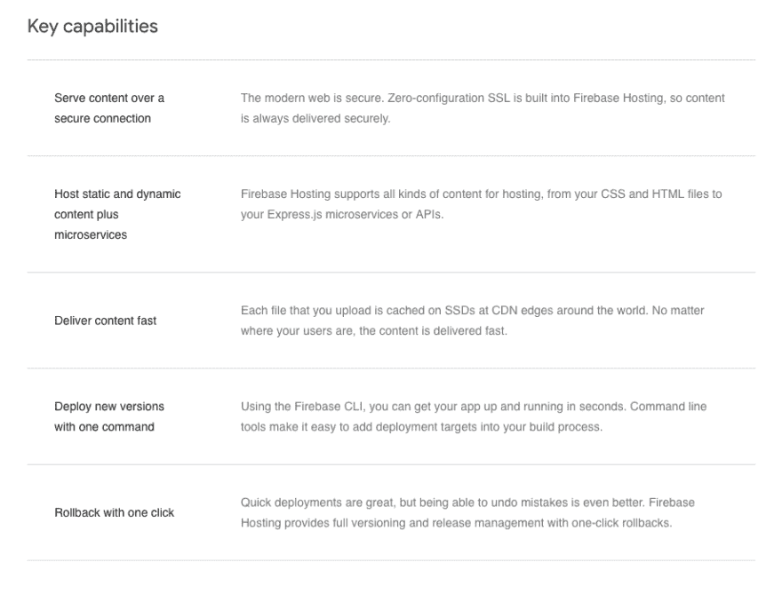
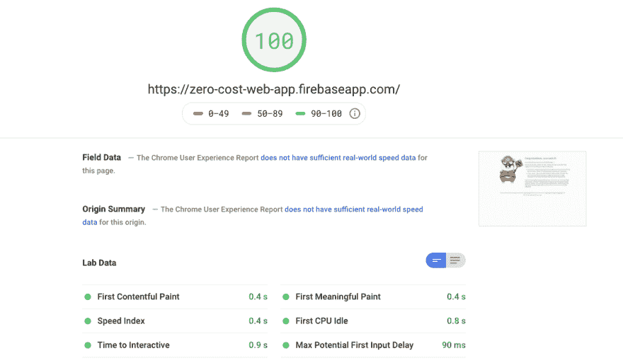
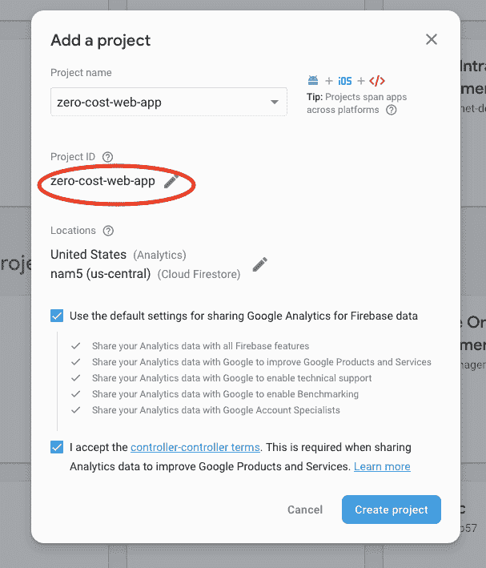
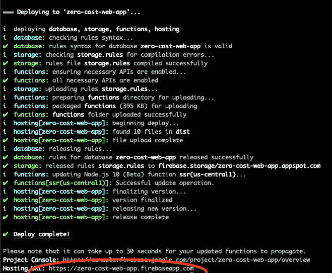
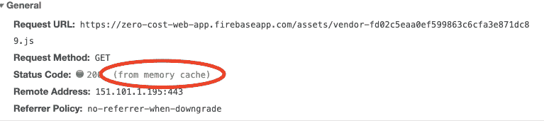

# 零成本 Web 应用程序第 1 部分

> 原文：<https://dev.to/devotox/zero-cost-web-app-part-1-f60>

> 这款应用将是革命性的…
> 这将是下一个脸书…
> 这就像 Instapaper 遇到 Kickstarter，有点像 Quora，但没有问题…

作为一名开发者，如果你每次听到这样的陈述都能得到一美元，那么你就不需要实际创造任何东西，因为你已经被铸造了。

我们处在一个每个人，包括你在内，都相信自己有下一个十亿美元的想法的时代。尽管我们很想开发任何东西，但是构建一个 web 应用程序所需的资源数量是巨大的。你需要一个服务器、数据库、主机提供商、SSL 证书等等。以你有限的收入，你怎么能在不烧钱的情况下开始创造“*下一个大事件*？

[](https://res.cloudinary.com/practicaldev/image/fetch/s--gy_SDyvJ--/c_limit%2Cf_auto%2Cfl_progressive%2Cq_auto%2Cw_880/https://cdn-images-1.medium.com/max/2000/1%2AZOiQh3jJNkG3Qt8xhLCVAw.jpeg)T3】

<center>*Empty Pockets*</center>

这是 3 部分系列的第 1 部分，深入研究一个可能的解决方案，以确保你不花一毛钱来构建你的应用程序，至少直到你有过多的用户。

有很多方法可以实现上述声明，但我们选择使用 [Ember](https://emberjs.com/) 作为我们的前端框架，使用 [Firebase](https://firebase.google.com) 作为我们的后端解决方案。我们发现，这个建议的解决方案是开发 web 应用程序的一种极其简单而有效的方法。

> Ember 是一个成熟的、自以为是的、全功能的 Javascript 框架，它使构建大规模应用程序变得容易。它认为自己是“雄心勃勃的网络开发者的框架”
> 
> Firebase 是一个全面的开发平台，为您提供开发高质量应用程序、扩大用户群和赚取更多收入的工具。它涵盖了基本要素，因此您可以将您的业务货币化，并专注于您的用户。

让我们从三个概念开始，这三个概念将是把你的想法转变成一个*令人敬畏的*网络应用的基础。

## 自由层

Firebase 最初只是一个实时数据库，但现在已经发展得越来越强大。

现在，我们为您提供了两种不同类型的数据库，即身份验证、文件存储、托管、全球 CDN 和 SSL，所有这些都有一个非常慷慨的免费层。

通过 [Firebase](https://firebase.google.com) 托管，我们利用谷歌分布在全球的边缘点来加速内容交付。谷歌数据中心的庞大规模允许你的应用在大量用户的压力下高效扩展。

[](https://res.cloudinary.com/practicaldev/image/fetch/s--uT0ft4pu--/c_limit%2Cf_auto%2Cfl_progressive%2Cq_auto%2Cw_880/https://cdn-images-1.medium.com/max/2000/1%2A2ZTwzABzw6ZWb-u0bcVH0w.png)T3】

<center>*Firebase Key Capabilities*</center>

## SSR(服务器端渲染)

我们将确保即使我们正在构建一个单页面应用程序，每个页面都可以在服务器端呈现，因为这对于下一步至关重要。

我们将使用 [Ember Fastboot](https://ember-fastboot.com/) 和 [Firebase Functions](https://firebase.google.com/docs/functions) ，一个无服务器函数的包装器，来完全呈现初始页面，并在 Javascript 文件被解析后立即恢复。

有了 SSR，我们可以在不损失 SPA(单页应用程序)的速度和动态性的情况下获得多重好处。

*   搜索引擎优化

*   功能退化

*   第一幅有意义的画

[](https://res.cloudinary.com/practicaldev/image/fetch/s--GvS6oZiO--/c_limit%2Cf_auto%2Cfl_progressive%2Cq_auto%2Cw_880/https://cdn-images-1.medium.com/max/2570/1%2AH6mLWQKlvs8P9eA_3LcTWg.png)T3】

<center>*Ember Fastboot*</center>

## 浏览器缓存

你想为了*速度*、*效率*而最小化到服务器的往返行程，但最重要的是，*成本*！

Firebase 的自由层在传输数据和每月调用的函数数量上都有限制。我们可以通过确保只调用服务器一次来减少达到这些限制的机会，除非资源被修改。

浏览器缓存和 SSR 一起通过将时间缩短到 *`First Meaningful Paint`来大幅加速你的应用程序。*

[](https://res.cloudinary.com/practicaldev/image/fetch/s--u7AyjgVv--/c_limit%2Cf_auto%2Cfl_progressive%2Cq_auto%2Cw_880/https://cdn-images-1.medium.com/max/2314/1%2ATWufGZRJbDxDKHAnPUZ5dA.png)T3】

<center>*Google Developer Page Insights*</center>

本指南将帮助您轻松完成上述概念。

*注意:你将从 [Github Gists](https://gist.github.com/devotox/94e56ee31adff980d148506f2368a0d1) 获取预先配置好的文件，而不是自己修改这些文件。*

所以让我们开始发展吧！

## 先决条件

*   安装[节点和 NPM](https://nodejs.org/en/download/)

*   转到 [Firebase 控制台](https://console.firebase.google.com)

*   创建一个名为零成本网络应用的 firebase 项目

*注意:项目 ID 稍后将用作您的应用程序的子域*

[](https://res.cloudinary.com/practicaldev/image/fetch/s--e4Ru8aPK--/c_limit%2Cf_auto%2Cfl_progressive%2Cq_auto%2Cw_880/https://cdn-images-1.medium.com/max/2000/1%2AhNLgH9cY5FaT7q5ZppWNwA.png)T3】

<center>*Create A Firebase Project*</center>

## 工具

安装全局软件包

```
#  npm install -g ember-cli
#  npm install -g firebase-tools 
```

## Web App

设置一个新的 Ember 应用程序

```
#  ember new zero-cost-web-app
#  cd zero-cost-web-app
#  ember install ember-cli-fastboot
#  ember install ember-fetch 
```

添加构建和部署应用程序所需的一组命令

*   构建 Ember 应用程序

*   运行本地服务器

*   部署到 Firebase 主机

```
#  curl https://gist.githubusercontent.com/devotox/94e56ee31adff980d148506f2368a0d1/raw/7de88b9b4dbb448e3c3103d993af594196800a1f/package.json -o package.json 
```

将快速启动主机白名单添加到环境配置中

```
#  curl https://gist.githubusercontent.com/devotox/94e56ee31adff980d148506f2368a0d1/raw/23de6376bb2f6bb5d839d93796c105f52dee4ab0/config%2520%257C%2520environment.js -o config/environment.js 
```

添加选项以在生产中包含欢迎页面

```
#  curl https://gist.githubusercontent.com/devotox/94e56ee31adff980d148506f2368a0d1/raw/63e94551c6cc6dda827b4dd1cd83d37b5d9ffd2b/ember-cli-build.js -o ember-cli-build.js 
```

确保安装了正确的软件包版本

```
#  npm install 
```

## 火基

设置 Firebase 项目

```
#  firebase login
#  firebase init 
```

按照提示设置新项目

*   使用空格键选择每个选项，使用向下箭头导航到下一个选项。然后在选择所有选项后按回车键

[](https://res.cloudinary.com/practicaldev/image/fetch/s--QIJCHd1d--/c_limit%2Cf_auto%2Cfl_progressive%2Cq_auto%2Cw_880/https://cdn-images-1.medium.com/max/2000/1%2A7c5eNIXvz0NMNgK6XzMOdA.png)T3】

<center>*Firebase Prompts*</center>

*   当你回答下一组问题时。按 enter 键选择每个默认选项

为 SSR 和缓存添加 Firebase 配置

```
#  curl [https://gist.githubusercontent.com/devotox/94e56ee31adff980d148506f2368a0d1/raw/d3a7fd29af85fcc25c3fedff1d2729058d4154f9/firebase.json](https://gist.githubusercontent.com/devotox/94e56ee31adff980d148506f2368a0d1/raw/d3a7fd29af85fcc25c3fedff1d2729058d4154f9/firebase.json) -o firebase.json 
```

删除可能已在 firebase init 上创建的索引文件

*   我们不需要这个，因为 Ember 应用程序会为我们提供自己的索引文件

```
#  rm -rf public/index.html 
```

## Firebase 功能

设置 Firebase 功能

```
#  cd functions/
#  npm install fastboot
#  npm install fetch
#  npm install ember-fetch 
```

更新索引文件以导出 SSR 云函数

```
#  curl https://gist.githubusercontent.com/devotox/94e56ee31adff980d148506f2368a0d1/raw/e446fd671489a5bafb86373c3ccef7da8d4d3b20/functions%2520%257C%2520index.js -o index.js 
```

返回到根目录

*   因为我们在函数子目录中。我们需要回到项目的根目录来运行下一个命令

```
#  cd .. 
```

## 启动应用程序

```
#  npm run build:firebase
#  firebase serve 
```

在默认浏览器中启动应用程序

```
#  open [http://localhost:5000](http://localhost:5000) 
```

## 部署

*   编译和构建应用程序(生产就绪)

*   构建云函数

*   把所有东西都拉上拉链，上传到 Firebase

```
#  npm run deploy:firebase 
```

转到终端中提供的 URL

*   您之前记下的项目 ID 将被用作子域。

*   网址应该类似于: *`https://<project-id>.firebaseapp.com`*

[](https://res.cloudinary.com/practicaldev/image/fetch/s--hJhNh-od--/c_limit%2Cf_auto%2Cfl_progressive%2Cq_auto%2Cw_880/https://cdn-images-1.medium.com/max/2000/1%2AqdotVrYslAmY3S3aSRWBMg.png)T3】

<center>*Get Hosting URL*</center>

## 期望

*   打开开发者工具，点击网络选项卡

*   找到索引页面的网址: *`https://<project-id>.firebaseapp.com`*

*   您应该注意到，页面呈现了完整的 HTML，而不需要执行 javascript。

*   您还应该注意到，在第一次命中后，现在应该从
    *`memory cache`* 中检索大部分资产

[](https://res.cloudinary.com/practicaldev/image/fetch/s--cPorpEJt--/c_limit%2Cf_auto%2Cfl_progressive%2Cq_auto%2Cw_880/https://cdn-images-1.medium.com/max/2000/1%2AxDy08QZrpgOpnDi8wHY-hA.png)T3】

<center>*Memory Cache*</center>

## 总结起来

随着谷歌服务器作为您的内容交付网络的大规模覆盖和缓存的广泛使用，您现在有能力构建*快速*、*高效*、*可扩展*和*雄心勃勃的* web 应用程序，而不会在资金开始滚滚而来之前破产。

现在向前迈进，征服网络应用领域！

在本系列的第 2 部分，我们将深入探讨如何将你的应用程序转换成 PWA(渐进式 Web 应用程序),并添加服务人员，让你可以离线运行你的应用程序！

<center>

<center>*Vooza*</center>

## 我们建造了什么

*   [成品](https://zero-cost-web-app.web.app/)

*   [Github 回购](https://github.com/devotox/zero-cost-web-app)

*   [Github Gists](https://gist.github.com/devotox/94e56ee31adff980d148506f2368a0d1)

## 进一步阅读

*   [Firebase](https://firebase.google.com) :用作我们的托管& SSL 提供商

*   [Firebase 功能](https://firebase.google.com/docs/functions):允许我们在没有服务器的情况下进行 SSR

*   [Ember](https://emberjs.com/) :用于创建我们的 SPA 的 Javascript 框架

*   Ember CLI :构建应用程序的命令行实用程序

*   [Ember Fastboot](https://ember-fastboot.com/) :为应用程序添加服务器端渲染

</center>